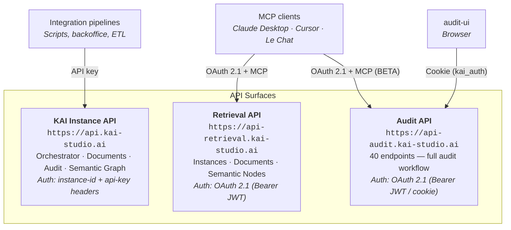

# Introduction

KAI exposes three distinct API surfaces, each tailored to a different class of consumer.

* **KAI Instance API** (`https://api.kai-studio.ai`) — low-level, machine-to-machine. Use it to build your own indexation pipelines or backoffice integrations.
* **Retrieval API** (`https://api-retrieval.kai-studio.ai`) — high-level, multi-tenant, group-aware. Primary path for exposing your KAI knowledge to a host LLM via MCP.
* **Audit API** (`https://api-audit.kai-studio.ai`) — drives the audit-ui workflow (browser) and, in BETA, lets an LLM coordinate an audit via MCP.

Continue to **Audiences — who uses what** to identify where your use case fits, and to **Why MCP** for the editorial context behind this split.
