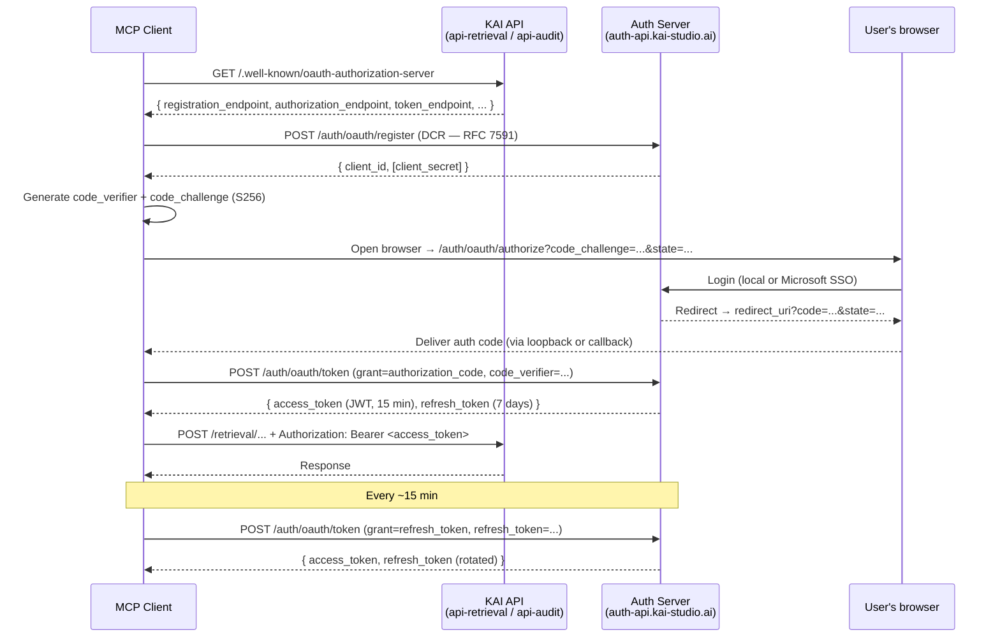

# OAuth flow for MCP (detailed)

### Sequence diagram

### Spec details

* **PKCE:** `S256` required. Plaintext (`plain`) not accepted.
* **Token lifetimes:** access token 15 min, refresh token 7 days.
* **Refresh rotation:** mandatory. Each refresh call returns a new refresh token and invalidates the old one immediately (forced rotation). If a revoked refresh token is presented again, the entire token chain is revoked and the user must re-authorize.
* **Authorization code TTL:** 10 minutes, single-use.
* **Access tokens:** HS256-signed JWTs. Claims include `sub` (user id), `exp`, `iat`, `aud`. There is no public JWKS endpoint — tokens are verified server-side only.
* **Token endpoint auth methods supported:** `client_secret_basic` and `client_secret_post` (both accepted).
* **Scope:** `mcp`.
* **DCR rate limit:** 5 requests per minute per IP. Localhost redirect URIs are rejected in production.

### Endpoints

| Purpose                         | URL                                                    | Method |
| ------------------------------- | ------------------------------------------------------ | ------ |
| Discovery (from either KAI API) | `https://<api>/.well-known/oauth-authorization-server` | GET    |
| Dynamic Client Registration     | `https://auth-api.kai-studio.ai/auth/oauth/register`   | POST   |
| Authorization                   | `https://auth-api.kai-studio.ai/auth/oauth/authorize`  | GET    |
| Token exchange & refresh        | `https://auth-api.kai-studio.ai/auth/oauth/token`      | POST   |
| Revocation                      | `https://auth-api.kai-studio.ai/auth/oauth/revoke`     | POST   |

Both `api-retrieval.kai-studio.ai` and `api-audit.kai-studio.ai` publish their own discovery document, but both point to the same Authorization Server. You only need to register your client once, and the resulting tokens are accepted on both APIs.

### Troubleshooting

* **401 after 15 min:** access token expired. Refresh it. Most MCP clients do this automatically.
* **`invalid_grant` on refresh:** your stored refresh token is stale — you used an older one after a successful rotation. Always replace the stored refresh token with the latest one returned.
* **CSRF / state mismatch:** you sent a different `state` than the Authorization Server received. Persist `state` for the lifetime of the flow.
* **Microsoft SSO loop:** confirm the user's browser is not blocking third-party cookies on `auth-api.kai-studio.ai`.
* **DCR rejected (429):** you exceeded the rate limit of 5 registrations per minute per IP. Wait and retry.

For a higher-level narrative on why MCP + OAuth, see OAuth 2.1 and Why MCP.
