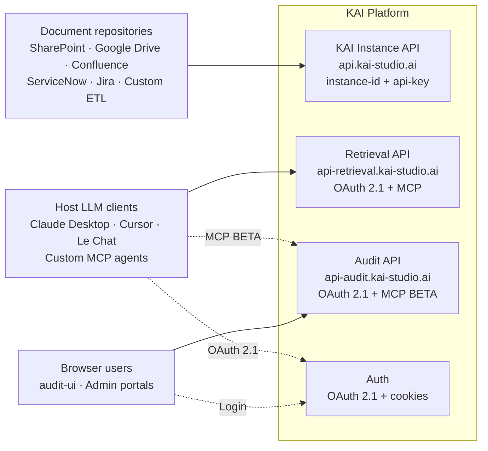
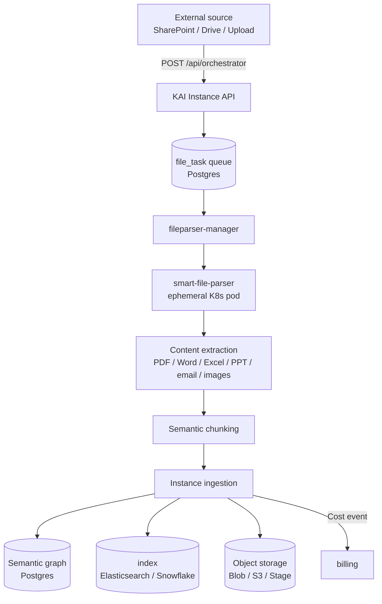
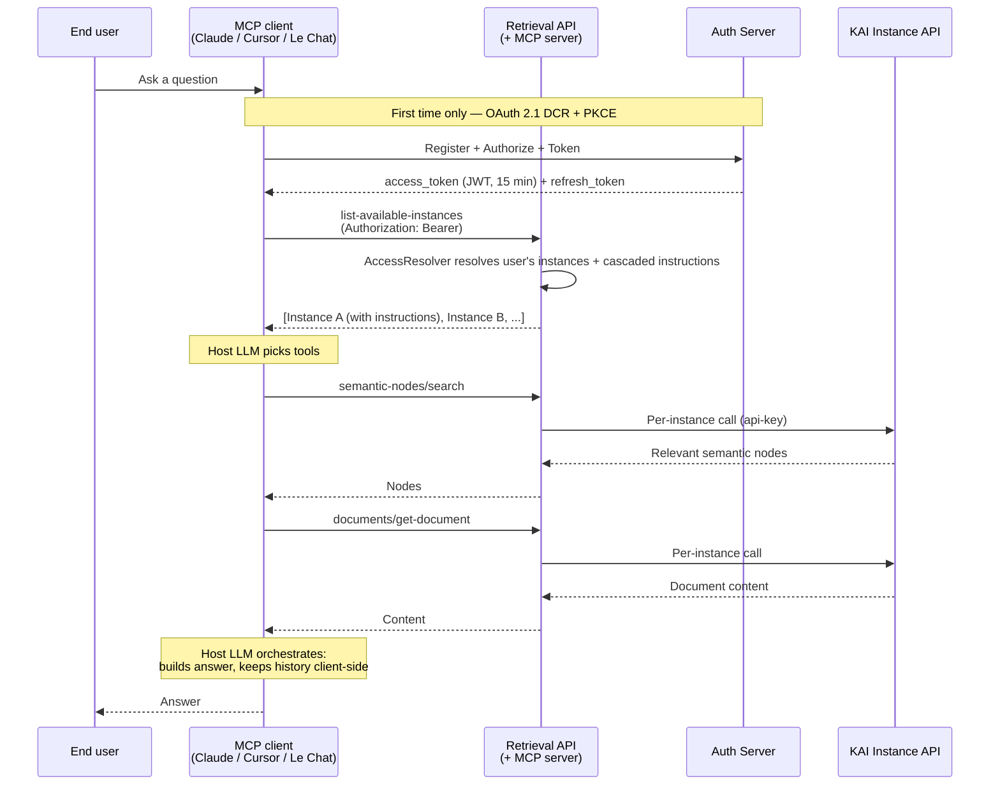
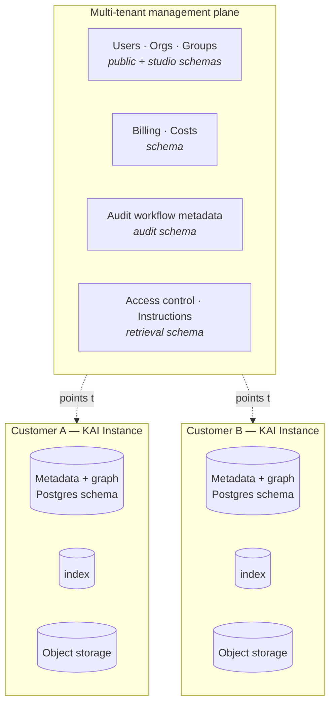

# Architecture

### Overview

KAI is an enterprise document intelligence and audit platform built on a **hybrid architecture**: per-customer **single-tenant instances** hold all document content and embeddings, while a shared **multi-tenant management plane** handles users, organisations, billing, and access control. Customer-facing access is delivered through three distinct API surfaces, each tailored to a class of consumer — machine-to-machine pipelines, browser users, and host-LLM clients via MCP.

For a visual entry point to the three API surfaces and who consumes each, see Platform overview.

### Core Components

#### KAI Instance (single-tenant)

One KAI Instance = one customer deployment. Each instance is a fully isolated stack:

* Its own K8s pod running the service
* Its own PostgreSQL schema (for metadata and the semantic graph)
* Its own vector index (Elasticsearch in SaaS, Snowflake `VECTOR` types in native-app deployments)
* Its own object storage (Azure Blob, S3, or Snowflake Stage)

The KAI Instance handles document ingestion via an orchestrator, extracts and stores document metadata, builds a semantic knowledge graph, and exposes raw audit primitives. Cross-instance data leakage is architecturally impossible.

Exposed via the **KAI Instance API** at `https://api.kai-studio.ai` — 33 endpoints across Orchestrator, Documents, Audit (raw), and Semantic Graph, authenticated with `instance-id` + `api-key` headers.

#### KAI Document Companion (multi-tenant management)

The management plane shared across all customers. Responsible for:

* User and organisation accounts, group memberships, RBAC
* Per-instance configuration, instructions cascade, access rules
* Subscription and billing state

Deployed as two services: `kaistudio-back` (core CRUD) and `user-functionnalities` (audit + retrieval modules, see below). **Stores no document content** — only metadata, identity, and access rules.

#### User Functionnalities (audit + retrieval modules)

A dedicated service hosting the two high-level APIs:

* **Audit module** — drives the document-audit workflow: state machine, duplicates, conflicts, mandatory questions. Consumed by the `audit-ui` (browser) and by host LLMs via MCP. Exposed as the **Audit API** at `https://api-audit.kai-studio.ai` (40 endpoints, MCP 🧪 BETA).
* **Retrieval module** — exposes the knowledge primitives (list instances, fetch documents, semantic search) that host LLMs need to orchestrate RAG and conversation client-side. Exposed as the **Retrieval API** at `https://api-retrieval.kai-studio.ai` (5 endpoints, MCP stable). **Replaces the deprecated `/search` and `/conversation` endpoints of the KAI Instance API** (both removed 2026-04-13).

Both modules authenticate users via OAuth 2.1 (for MCP and custom integrations) or HttpOnly cookies (for browsers). Access is group-aware — a single user token gives scoped access to exactly the instances the user is entitled to.

#### Centralized Auth

A dedicated service (`STUDIO/auth`) that provides:

* HttpOnly cookie issuance (`kai_auth` on `.kai-studio.ai`) for all KAI frontends
* A full **OAuth 2.1 Authorization Server** (Dynamic Client Registration, PKCE, refresh-token rotation) for MCP clients and custom integrations
* **Microsoft SSO** via multi-tenant Azure AD (OIDC)

See Authentication — OAuth 2.1 for the full flow, and MCP Reference — OAuth flow (detailed) for the sequence diagram.

#### Supporting services

* **smart-file-parser** — content extraction from PDF / Word / Excel / PowerPoint / email / images, plus semantic chunking. Runs as ephemeral K8s pods spawned per task.
* **web-crawler** — crawls external URLs as a knowledge source (6-stage Playwright pipeline).

### Integration Architecture

#### How KAI Connects to Your Systems

KAI integrates through three distinct patterns, each matching a class of consumer:

#### Integration Points

* **Document sources → KAI Instance** — ingestion via the SDK's KB sources (SharePoint, Google Drive, Confluence, ServiceNow, Jira, Generic HTTP), S3/Blob drops, or direct upload through the Orchestrator endpoints. Each source becomes a document entry, parsed by `smart-file-parser`, and indexed into the instance's semantic graph.
* **Host LLM clients → Retrieval MCP / Audit MCP** — any MCP-compatible client discovers OAuth at the MCP URL, authenticates the end-user (local password or Microsoft SSO), and calls KAI primitives as tools. See MCP Reference — Connecting a client for one-click install and manual configuration per client.
* **Identity providers → Auth service** — Microsoft SSO is supported today (multi-tenant Azure AD / OIDC). Additional providers are a natural extension.
* **Observability → your SIEM / log aggregator** — metrics are exported in standard formats (see Monitoring below).

### Data Flow

#### Document Indexing Flow

Document state machine: `INITIAL_SAVED → ON_CONTENT_EXTRACT → INDEXED`. The instance exposes status via the Orchestrator and Documents endpoints for client-side progress tracking.

#### Query Processing Flow (MCP-based)

**This replaces the old server-side `/search` + `/conversation`.** KAI no longer performs RAG or maintains conversation state server-side — the host LLM does the orchestration. See Why MCP for the editorial rationale.

A single user token gives access to exactly the instances the user is entitled to. The MCP client never sees an `api-key`; the Retrieval service translates user identity into per-instance credentials internally.

### Security & Data Isolation

#### Hybrid Architecture: Single-Tenant Instances, Multi-Tenant Management

Customer data (documents, embeddings, semantic graph, audit artifacts) lives in **per-customer single-tenant KAI Instances** — one K8s pod + one DB schema + one index store + one storage bucket per instance. Platform management state (users, orgs, billing, workflow metadata) lives in a shared **multi-tenant management plane** that stores no document content.

#### KAI Instance: Single-Tenant Architecture

One customer = one dedicated stack. Access is gated by a `(instance_id, api_key)` pair — scoped to exactly one instance, shared neither across instances nor across customers. Key rotation is a one-click admin action that invalidates the previous key immediately.

#### KAI Document Companion: Multi-Tenant Architecture

Handles identity, access control, configurations, billing. Stores **no document content** — only metadata pointers, access rules, audit-workflow state, and cost events.

#### How It Works Together

When a user calls the Retrieval API with their OAuth Bearer token, the multi-tenant plane identifies them, `AccessResolver` computes the set of accessible instances and the cascaded instructions that apply (org default → instance → group), and the Retrieval service uses per-instance credentials to reach the underlying KAI Instance API.

The MCP client never sees an `api-key`. Customer data never crosses the instance boundary.

#### Data Storage & Privacy

* **Document content** — per-instance object storage (Azure Blob in SaaS, S3 on-premises, Snowflake Stage in Native Apps).
* **Embeddings** — per-instance Elasticsearch index (SaaS) or Snowflake `VECTOR` types (Native Apps).
* **Semantic graph** — per-instance PostgreSQL schema.
* **Management metadata** — shared `public` / `studio` / `audit` / `retrieval` / `picsou` schemas. No document content.
* **Encryption** — at-rest encryption provided by the underlying storage (Azure / AWS / Snowflake native). Secrets and connection strings are encrypted with Fernet. OAuth tokens are HS256-signed; the signing key (`SECRET_KEY`) is shared across services within a deployment.

#### Security Measures

* **OAuth 2.1** with PKCE (`S256` mandatory) and refresh-token rotation for MCP and custom user-level integrations.
* **HttpOnly cookies** (`kai_auth` on `.kai-studio.ai`) for browser-based frontends. No JavaScript access to the token.
* **`instance-id` + `api-key` headers** for machine-to-machine — scoped to a single instance.
* **Rate limiting** on the Auth service: 5 login attempts per minute per IP, account lockout after 10 consecutive failures.
* **Microsoft SSO** (multi-tenant Azure AD / OIDC) available for enterprise customers.
* **TLS everywhere**, Let's Encrypt via cert-manager for public endpoints.
* **Group-based RBAC** at the Retrieval API level — per-instance visibility, instruction cascade, enforced transparently on every MCP tool call.

### Scalability & Performance

#### Auto-scaling architecture

* Stateless HTTP services (audit API, retrieval API, web frontends) scale horizontally via multi-replica K8s deployments behind NGINX ingress.
* LLM inference runs on a dedicated AWS EKS cluster with **tiered failover**
* Document indexation runs as ephemeral K8s pods spawned per task by `fileparser-manager` — each pod processes one document and terminates.

#### Performance characteristics

* **Stateless compute tier** — any replica can serve any request; no sticky sessions needed.
* **Queue-based processing** — LLM and indexation pipelines are queue-backed, which decouples spikes from user-facing latency.
* **Per-instance isolation** — one noisy customer does not impact another: compute pods, databases, and storage are physically separate.
* **MCP servers run in stateless mode** — no server-side sessions, safe for multi-replica behind a load balancer.

### Deployment Models

#### SaaS

Azure AKS cluster in `francecentral`, customer instances deployed as isolated pods. NGINX ingress + cert-manager. Customers access KAI under the `kai-studio.ai` domain (per-subdomain routing for the management + API surfaces). Managed operationally by our team; no customer infrastructure required.

#### On-Premises

Identical K8s architecture deployed inside the customer's own cluster. Deployment documentation — including K8s templates, procedures, hardware requirements, and air-gapped support (`export-images.sh` / `import-images.sh` for offline Docker image transfer).

#### Snowflake Marketplace (Native Apps)

Deployed as Snowflake Container Services (SPCS) inside the customer's own Snowflake account. Data never leaves Snowflake: documents are stored in Stages, embeddings in `VECTOR` columns, and the management metadata sits in dedicated schemas.

### Architecture Principles

#### Separation of Concerns

* **Customer data vs management metadata** — physically separated into single-tenant instances and the multi-tenant management plane.
* **User-facing vs machine-to-machine** — distinct API surfaces with distinct auth models. No single endpoint serves both, which simplifies reasoning about permissions and audit trails.
* **One service owns one schema** — cross-schema reads are allowed, but writes are strictly owned.

#### API-First Design

* Every user-visible capability has a documented API. UIs are thin clients over those APIs.
* MCP exposes Retrieval and Audit APIs as tools for host-LLM orchestration — no ad-hoc server-side LLM logic.
* New capabilities ship as API changes first; UIs follow.

#### Stateless Operations

* HTTP services hold no client session state server-side. Identity travels in the request (Bearer or cookie), configuration lives in the DB.
* MCP servers are stateless, safe behind any load balancer.
* Background workers are idempotent-by-design — tasks can be retried without side-effects.

### Monitoring & Observability

#### What KAI monitors (platform-side)

* Infrastructure metrics per pod — CPU, memory, request latency, error rates.
* Queue depth on the LLM router and indexation pipeline.
* Cost events per instance and per organisation, aggregated into KCU.
* Auth service events — login attempts, rate-limit trips, OAuth token issuance and rotation.
* MCP tool invocations for usage analytics.

#### What clients can monitor

* Per-instance indexation status through the Orchestrator and Documents endpoints.
* Cost and consumption reports through dashboards (per-organisation view).
* OAuth token lifecycle through the Auth service session endpoints.
* On the MCP client side — tool-invocation logs visible directly in Claude Desktop, Cursor, or Le Chat.

### Integration Best Practices

#### Document repository integration

* **Prefer incremental syncs** over full re-indexations — the SDK's KB sources support delta detection. Full re-indexation is O(documents × cost-per-parse); incremental is O(changes).
* Schedule indexation during low-traffic windows when possible.
* Monitor the document state machine to catch failed extractions promptly.
* Store `instance-id` + `api-key` in a secure secret manager.

#### AI system integration (LLM + MCP)

* For end-user agent integration, **prefer MCP over direct Retrieval API calls**. The OAuth flow handles user consent, token refresh, and revocation automatically; there is no key management to do on the client side.
* **Let the host LLM orchestrate retrieval.** Do not build server-side RAG on top of the Retrieval API — the whole point of the MCP shift is that the client does orchestration. Server-side RAG duplicates work the host LLM already does natively.
* For custom non-MCP agents, discover the OAuth configuration at `https://api-retrieval.kai-studio.ai/.well-known/oauth-authorization-server` and implement the full DCR + PKCE flow. See MCP Reference — OAuth flow (detailed).

### Next Steps

#### For technical teams

* Start with the Platform overview for a visual summary of the three API surfaces.
* Then go to the reference section that matches your use case:
  * KAI Instance API for machine-to-machine pipelines.
  * Retrieval API for host-LLM / MCP integrations.
  * Audit API for automating document-audit workflows.
* For MCP specifically, read the MCP Reference section.

#### For business teams

* Audiences — who uses what is the fastest way to identify where your use case fits.
* Why MCP explains the editorial rationale behind the `/search` and `/conversation` deprecation and the shift to MCP-based orchestration.
