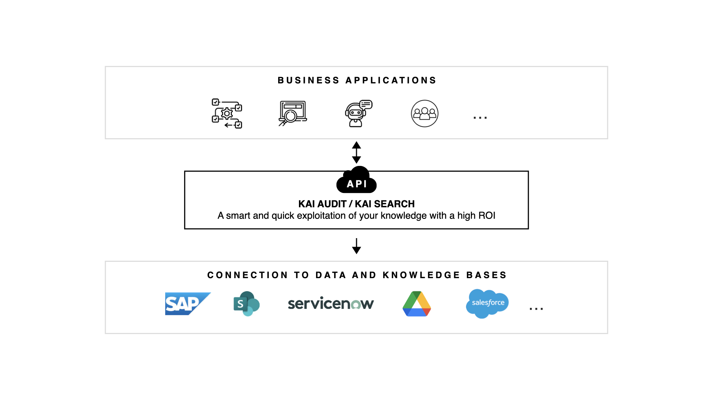
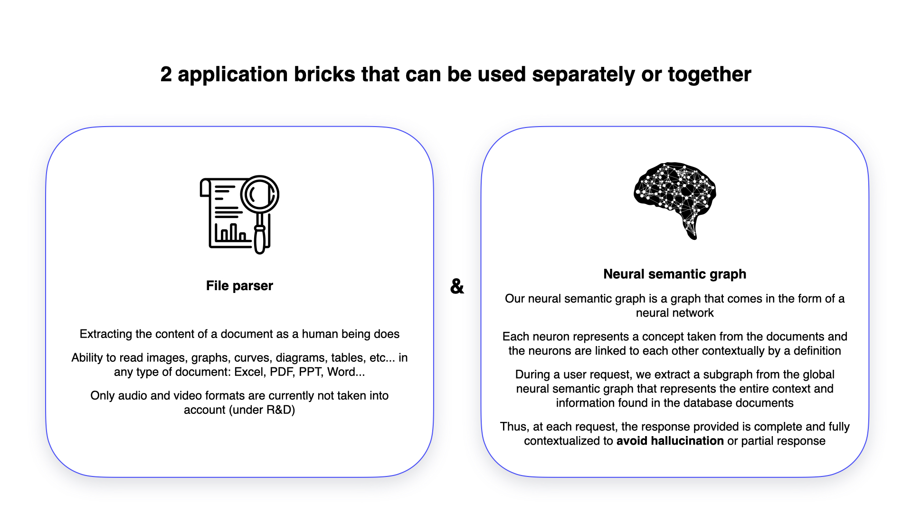

# KAI Technology

### How Does It Work?

On one side, you owns some Knowledge bases : SharePoint, Service Now, Drive, ...\
On the other side, your applications : Chatbot, Intern tools, ..\
How to connect them and offer the power of Artificial Intelligence ?&#x20;

**KAI serves as a middleware.** Between your knowledge bases and applications, it connects to various document repositories, processes queries through your APIs, and delivers optimized responses to the client front interface.

<figure><figcaption></figcaption></figure>

### Behind the curtains : Some elements of our solutions

......

<figure><figcaption></figcaption></figure>

Parler de LLM, mais pas trop en détail,  Rester grand public. Détails techiques a mettre coté Tech.

Rajouter un lien , pour en savoir plus vers la page Spécifications techniques.
