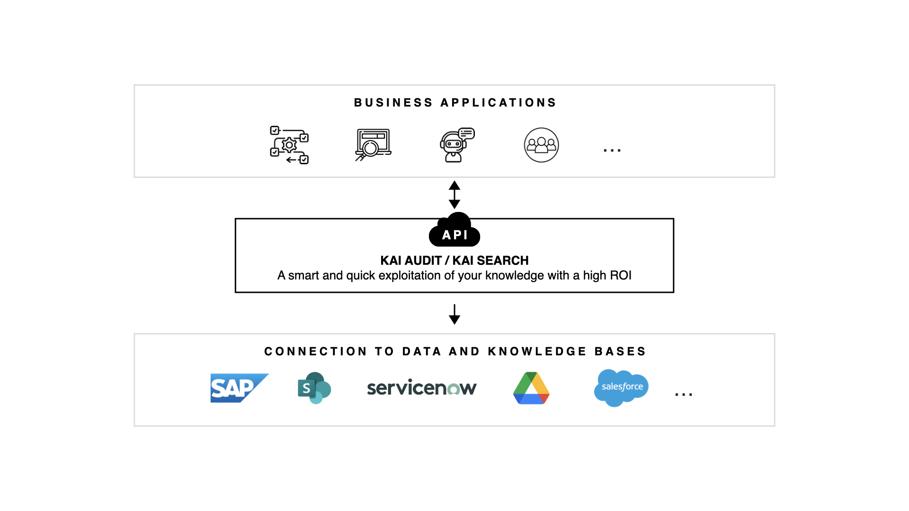
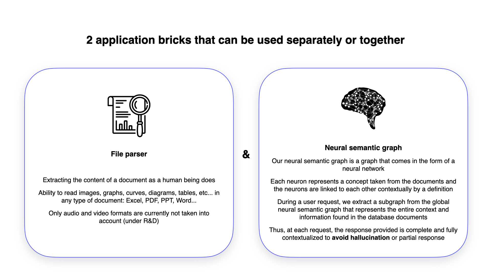

# KAI Technology

### How Does It Work?

On one side, you owns some Knowledge bases : SharePoint, ServiceNow, Drive, ...\
On the other side, your applications : Chatbot, Intern tools, ..\
How to connect them and offer the power of Artificial Intelligence ?&#x20;

**KAI serves as a middleware.** Between your knowledge bases and applications, it connects to various document repositories, processes queries through your APIs, and delivers optimized responses to the client front interface.

<figure><figcaption></figcaption></figure>

### Behind the curtains

From the user to the answer. Between the chatbot interface and the user, the AI magic is in fact several bricks to understand, analyse et write an answer. You can find below, the big steps to create an answer in general case, with a classic AI solution or the KAI solution. The difference is also our advantage.&#x20;

> [Check the RAG VS. KAI's Graph solution comparison here.](kai-advantages.md)

<figure><figcaption></figcaption></figure>

#### Some elements of our solutions

<figure><figcaption></figcaption></figure>

